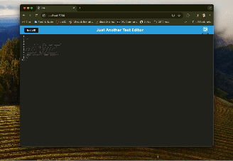

  
<h1 align="center">PWA Text Editor </h1>

  
  
  
 

## Description 📚

- What was your motivation? Why did you build this project? What problem does it solve? What did you learn?

This project is built using Progressive Web Applications and Render to deply the project.

This was created using .

## Table of Contents 

- [User-Story](#user-story)
- [Acceptance-Criteria](#acceptance-criteria)
- [Installation](#installation-📋)
- [Usage](#usage-🏁)
- [Demonstration](#demonstration)
- [Author](#author-👋🏽)

## User Story

AS A developer:
I WANT to create notes or code snippets with or without an internet connection SO THAT I can reliably retrieve them for later use

## Acceptance Criteria

GIVEN a text editor web application:
- WHEN I open my application in my editor THEN I should see a client server folder structure
- WHEN I run `npm run start` from the root directory THEN I find that my application should start up the backend and serve the client
- WHEN I run the text editor application from my terminal THEN I find that my JavaScript files have been bundled using webpack
- WHEN I run my webpack plugins THEN I find that I have a generated HTML file, service worker, and a manifest file
- WHEN I use next-gen JavaScript in my application THEN I find that the text editor still functions in the browser without errors
- WHEN I open the text editor THEN I find that IndexedDB has immediately created a database storage
- WHEN I enter content and subsequently click off of the DOM window THEN I find that the content in the text editor has been saved with IndexedDB
- WHEN I reopen the text editor after closing it THEN I find that the content in the text editor has been retrieved from our IndexedDB
- WHEN I click on the Install button THEN I download my web application as an icon on my desktop
- WHEN I load my web application THEN I should have a registered service worker using workbox
- WHEN I register a service worker THEN I should have my static assets pre cached upon loading along with subsequent pages and static assets
- WHEN I deploy to Render THEN I should have proper build scripts for a webpack application

## Installation 📋

Installation for this application begins with cloning the repository to your local machine by typing `git clone https://github.com/schneidsmc/PWATextEditor.git` in the command line. Once you have navigate into that directory and opened it in vsCode, you open an integrated terminal for the root directory of the application and use the `npm i` command in the command line. This will make the installs happen for all of the folders. 

After you have installed all teh necessary dependencies, you run `npm run build` or `npm run start` in the command line to begin the build using the webpack. this will create a dist folder and the comnsole.log will let you know that it is running on port 3000.

Once you open the app you can install it onto your local machine by hitting the install button on the top right. 

Make sure you don't have pop-up blockers blocking the install.

## Usage 🏁

Once you have everything up and running, this is a great application to store notes. You can type and it will store everything so you can close and reopen the app to the same information. 

If you install the PWA from the web server, you can use the application offline.

## Demonstration

[Here](https://pwatexteditor-njc8.onrender.com/) is the deployed link on Render. 
You can click the link above but this is what the URL looks like: https://pwatexteditor-njc8.onrender.com/.

This is a short gif showing the functionality of the PWA.

 

Here is a screenshot of the Manifest.json.

 

Here is a screenshot of the Service Worker.

 

Here is a screenshot of the data in IndexedDb.

 

This is a screenshot of the application deployed using Render. You can see the URL.

 

## Author 👋🏽

Deployed Render URL: [PWA Text Editor]( https://pwatexteditor-njc8.onrender.com/)

Git Hub Repo: [PWA Text Editor](https://github.com/schneidsmc/PWATextEditor.git)

GitHub Username: [schneidsmc](https://github.com/schneidsmc)

📧 Email: schneidsmc@gmail.com

This README was created with ❤️ using README Generator 👏🏽👏🏽

